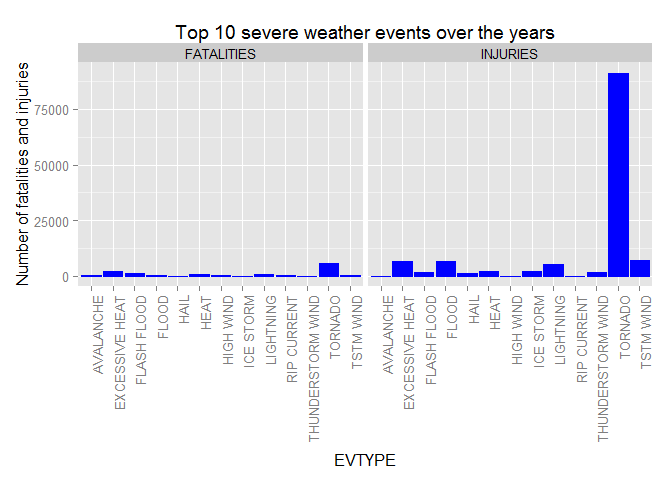
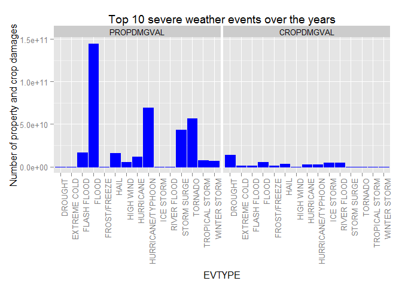

# Analysis of severe weather events across US with Tornado and Floor having greatest impact to population and economy


## Synopsis

This report uses data collected from NOAA Storm Database from year 1950 to 2011. The objective is to analyse the data on which severe weather events across US are most harmful to population health or have the greatest economic consequences. It will assist the respective agency to prioritize resources and prepare accordingly for different types of weather events. 

In summary, Tornado ranks the highest weather event that causes the greatest fatality and injury count thus becoming the most harmful event to population while Flood causes the highest property and crop damages thus resulting in the most impact to economy.


## Data Processing

Here's the script to download and extract the storm dataset


```r
filename<-"repdata-data-StormData.csv.bz2"
if (!file.exists(filename)){
  fileUrl <- "https://d396qusza40orc.cloudfront.net/repdata%2Fdata%2FStormData.csv.bz2"

  download.file(fileUrl, destfile="./repdata-data-StormData.csv.bz2") 

  #install.packages("R.utils")
  library(R.utils)
  bunzip2("repdata-data-StormData.csv.bz2", remove = FALSE)
}
```

Here's a sample of the weather events dataset


```r
txn <- read.csv("repdata-data-StormData.csv")
head(txn,10)
```

```
##    STATE__           BGN_DATE BGN_TIME TIME_ZONE COUNTY COUNTYNAME STATE
## 1        1  4/18/1950 0:00:00     0130       CST     97     MOBILE    AL
## 2        1  4/18/1950 0:00:00     0145       CST      3    BALDWIN    AL
## 3        1  2/20/1951 0:00:00     1600       CST     57    FAYETTE    AL
## 4        1   6/8/1951 0:00:00     0900       CST     89    MADISON    AL
## 5        1 11/15/1951 0:00:00     1500       CST     43    CULLMAN    AL
## 6        1 11/15/1951 0:00:00     2000       CST     77 LAUDERDALE    AL
## 7        1 11/16/1951 0:00:00     0100       CST      9     BLOUNT    AL
## 8        1  1/22/1952 0:00:00     0900       CST    123 TALLAPOOSA    AL
## 9        1  2/13/1952 0:00:00     2000       CST    125 TUSCALOOSA    AL
## 10       1  2/13/1952 0:00:00     2000       CST     57    FAYETTE    AL
##     EVTYPE BGN_RANGE BGN_AZI BGN_LOCATI END_DATE END_TIME COUNTY_END
## 1  TORNADO         0                                               0
## 2  TORNADO         0                                               0
## 3  TORNADO         0                                               0
## 4  TORNADO         0                                               0
## 5  TORNADO         0                                               0
## 6  TORNADO         0                                               0
## 7  TORNADO         0                                               0
## 8  TORNADO         0                                               0
## 9  TORNADO         0                                               0
## 10 TORNADO         0                                               0
##    COUNTYENDN END_RANGE END_AZI END_LOCATI LENGTH WIDTH F MAG FATALITIES
## 1          NA         0                      14.0   100 3   0          0
## 2          NA         0                       2.0   150 2   0          0
## 3          NA         0                       0.1   123 2   0          0
## 4          NA         0                       0.0   100 2   0          0
## 5          NA         0                       0.0   150 2   0          0
## 6          NA         0                       1.5   177 2   0          0
## 7          NA         0                       1.5    33 2   0          0
## 8          NA         0                       0.0    33 1   0          0
## 9          NA         0                       3.3   100 3   0          1
## 10         NA         0                       2.3   100 3   0          0
##    INJURIES PROPDMG PROPDMGEXP CROPDMG CROPDMGEXP WFO STATEOFFIC ZONENAMES
## 1        15    25.0          K       0                                    
## 2         0     2.5          K       0                                    
## 3         2    25.0          K       0                                    
## 4         2     2.5          K       0                                    
## 5         2     2.5          K       0                                    
## 6         6     2.5          K       0                                    
## 7         1     2.5          K       0                                    
## 8         0     2.5          K       0                                    
## 9        14    25.0          K       0                                    
## 10        0    25.0          K       0                                    
##    LATITUDE LONGITUDE LATITUDE_E LONGITUDE_ REMARKS REFNUM
## 1      3040      8812       3051       8806              1
## 2      3042      8755          0          0              2
## 3      3340      8742          0          0              3
## 4      3458      8626          0          0              4
## 5      3412      8642          0          0              5
## 6      3450      8748          0          0              6
## 7      3405      8631          0          0              7
## 8      3255      8558          0          0              8
## 9      3334      8740       3336       8738              9
## 10     3336      8738       3337       8737             10
```

```r
str(txn)
```

```
## 'data.frame':	902297 obs. of  37 variables:
##  $ STATE__   : num  1 1 1 1 1 1 1 1 1 1 ...
##  $ BGN_DATE  : Factor w/ 16335 levels "1/1/1966 0:00:00",..: 6523 6523 4242 11116 2224 2224 2260 383 3980 3980 ...
##  $ BGN_TIME  : Factor w/ 3608 levels "00:00:00 AM",..: 272 287 2705 1683 2584 3186 242 1683 3186 3186 ...
##  $ TIME_ZONE : Factor w/ 22 levels "ADT","AKS","AST",..: 7 7 7 7 7 7 7 7 7 7 ...
##  $ COUNTY    : num  97 3 57 89 43 77 9 123 125 57 ...
##  $ COUNTYNAME: Factor w/ 29601 levels "","5NM E OF MACKINAC BRIDGE TO PRESQUE ISLE LT MI",..: 13513 1873 4598 10592 4372 10094 1973 23873 24418 4598 ...
##  $ STATE     : Factor w/ 72 levels "AK","AL","AM",..: 2 2 2 2 2 2 2 2 2 2 ...
##  $ EVTYPE    : Factor w/ 985 levels "   HIGH SURF ADVISORY",..: 834 834 834 834 834 834 834 834 834 834 ...
##  $ BGN_RANGE : num  0 0 0 0 0 0 0 0 0 0 ...
##  $ BGN_AZI   : Factor w/ 35 levels "","  N"," NW",..: 1 1 1 1 1 1 1 1 1 1 ...
##  $ BGN_LOCATI: Factor w/ 54429 levels "","- 1 N Albion",..: 1 1 1 1 1 1 1 1 1 1 ...
##  $ END_DATE  : Factor w/ 6663 levels "","1/1/1993 0:00:00",..: 1 1 1 1 1 1 1 1 1 1 ...
##  $ END_TIME  : Factor w/ 3647 levels ""," 0900CST",..: 1 1 1 1 1 1 1 1 1 1 ...
##  $ COUNTY_END: num  0 0 0 0 0 0 0 0 0 0 ...
##  $ COUNTYENDN: logi  NA NA NA NA NA NA ...
##  $ END_RANGE : num  0 0 0 0 0 0 0 0 0 0 ...
##  $ END_AZI   : Factor w/ 24 levels "","E","ENE","ESE",..: 1 1 1 1 1 1 1 1 1 1 ...
##  $ END_LOCATI: Factor w/ 34506 levels "","- .5 NNW",..: 1 1 1 1 1 1 1 1 1 1 ...
##  $ LENGTH    : num  14 2 0.1 0 0 1.5 1.5 0 3.3 2.3 ...
##  $ WIDTH     : num  100 150 123 100 150 177 33 33 100 100 ...
##  $ F         : int  3 2 2 2 2 2 2 1 3 3 ...
##  $ MAG       : num  0 0 0 0 0 0 0 0 0 0 ...
##  $ FATALITIES: num  0 0 0 0 0 0 0 0 1 0 ...
##  $ INJURIES  : num  15 0 2 2 2 6 1 0 14 0 ...
##  $ PROPDMG   : num  25 2.5 25 2.5 2.5 2.5 2.5 2.5 25 25 ...
##  $ PROPDMGEXP: Factor w/ 19 levels "","-","?","+",..: 17 17 17 17 17 17 17 17 17 17 ...
##  $ CROPDMG   : num  0 0 0 0 0 0 0 0 0 0 ...
##  $ CROPDMGEXP: Factor w/ 9 levels "","?","0","2",..: 1 1 1 1 1 1 1 1 1 1 ...
##  $ WFO       : Factor w/ 542 levels ""," CI","$AC",..: 1 1 1 1 1 1 1 1 1 1 ...
##  $ STATEOFFIC: Factor w/ 250 levels "","ALABAMA, Central",..: 1 1 1 1 1 1 1 1 1 1 ...
##  $ ZONENAMES : Factor w/ 25112 levels "","                                                                                                                               "| __truncated__,..: 1 1 1 1 1 1 1 1 1 1 ...
##  $ LATITUDE  : num  3040 3042 3340 3458 3412 ...
##  $ LONGITUDE : num  8812 8755 8742 8626 8642 ...
##  $ LATITUDE_E: num  3051 0 0 0 0 ...
##  $ LONGITUDE_: num  8806 0 0 0 0 ...
##  $ REMARKS   : Factor w/ 436774 levels "","-2 at Deer Park\n",..: 1 1 1 1 1 1 1 1 1 1 ...
##  $ REFNUM    : num  1 2 3 4 5 6 7 8 9 10 ...
```

```r
#summary(txn)
```


## Results

Which types of events are most harmful to population health? We will based it on the fatality and injury count.


```r
#retrieve the number of fatalities and injuries by event
fatal <- aggregate(FATALITIES ~ EVTYPE, data = txn, FUN = sum)
injury <- aggregate(INJURIES ~ EVTYPE, data = txn, FUN = sum)

#choose top 10 events for each category
fatal10 <- fatal[order(-fatal$FATALITIES), ][1:10, ]
injury10 <- injury[order(-injury$INJURIES), ][1:10, ]

#combine to a dataset
storm_event <- data.frame(EVTYPE=unique(txn$EVTYPE))
txn_harmful <- merge(storm_event, fatal10, by="EVTYPE",all.x=T)
txn_harmful <- merge(txn_harmful, injury10, by="EVTYPE",all.x=T)
txn_harmful <- subset(txn_harmful, !is.na(FATALITIES)|!is.na(INJURIES))   
txn_harmful[is.na(txn_harmful$FATALITIES)==TRUE,2]<-0
txn_harmful[is.na(txn_harmful$INJURIES)==TRUE,3]<-0

#transpose to category
library(reshape2)
```

```
## Warning: package 'reshape2' was built under R version 3.1.1
```

```r
txn_harmful <- melt(txn_harmful, id=c("EVTYPE"))
colnames(txn_harmful)<-c("EVTYPE","CATEGORY","COUNT")

#convert to character
txn_harmful$EVTYPE <- as.character(txn_harmful$EVTYPE)

#plot histogram
library(ggplot2)
```

```
## Warning: package 'ggplot2' was built under R version 3.1.3
```

```r
ggplot(txn_harmful, aes(x=EVTYPE,y=COUNT)) +
  geom_bar(stat="identity", color = "blue",fill="blue") +
  labs(title = "Top 10 severe weather events over the years") +
  theme(axis.text.x = element_text(angle = 90, hjust = 1)) + 
  facet_wrap(~CATEGORY) +
  ylab("Number of fatalities and injuries")
```

 

From both graphs, Tornado ranks the highest event in terms of highest fatality and injury count.


Which types of events have the greatest economic consequences?


```r
#update for property damage (Refer to Page 12 of the document)
table(txn$PROPDMGEXP)
```

```
## 
##             -      ?      +      0      1      2      3      4      5 
## 465934      1      8      5    216     25     13      4      4     28 
##      6      7      8      B      h      H      K      m      M 
##      4      5      1     40      1      6 424665      7  11330
```

```r
txn$PROPEXP <- 0 #applies to those PROPDMGEXP with -, ?, +, 0
txn$PROPEXP[txn$PROPDMGEXP == "1"] <- 10
txn$PROPEXP[txn$PROPDMGEXP == "2"] <- 100
txn$PROPEXP[txn$PROPDMGEXP == "h"] <- 100 #hundreds
txn$PROPEXP[txn$PROPDMGEXP == "H"] <- 100 #hundreds
txn$PROPEXP[txn$PROPDMGEXP == "3"] <- 1000
txn$PROPEXP[txn$PROPDMGEXP == "K"] <- 1000  #thousands
txn$PROPEXP[txn$PROPDMGEXP == "4"] <- 10000
txn$PROPEXP[txn$PROPDMGEXP == "5"] <- 1e+05
txn$PROPEXP[txn$PROPDMGEXP == "6"] <- 1e+06
txn$PROPEXP[txn$PROPDMGEXP == "M"] <- 1e+06 #millions
txn$PROPEXP[txn$PROPDMGEXP == "m"] <- 1e+06 #millions
txn$PROPEXP[txn$PROPDMGEXP == "7"] <- 1e+07
txn$PROPEXP[txn$PROPDMGEXP == "8"] <- 1e+08
txn$PROPEXP[txn$PROPDMGEXP == "B"] <- 1e+09 #billions

#compute property damage value
txn$PROPDMGVAL <- txn$PROPDMG * txn$PROPEXP


#update for crops damage
table(txn$CROPDMGEXP)
```

```
## 
##             ?      0      2      B      k      K      m      M 
## 618413      7     19      1      9     21 281832      1   1994
```

```r
txn$CROPEXP <- 0 #applies to those CROPDMGEXP with ?, 0

txn$CROPEXP[txn$CROPDMGEXP == "2"] <- 100
txn$CROPEXP[txn$CROPDMGEXP == "k"] <- 1000
txn$CROPEXP[txn$CROPDMGEXP == "K"] <- 1000
txn$CROPEXP[txn$CROPDMGEXP == "M"] <- 1e+06
txn$CROPEXP[txn$CROPDMGEXP == "m"] <- 1e+06
txn$CROPEXP[txn$CROPDMGEXP == "B"] <- 1e+09

#compute crop damage value
txn$CROPDMGVAL <- txn$CROPDMG * txn$CROPEXP


#retrieve the number of crop damages by category
property <- aggregate(PROPDMGVAL ~ EVTYPE, data = txn, FUN = sum)
crop <- aggregate(CROPDMGVAL ~ EVTYPE, data = txn, FUN = sum)

#choose top 10 events for each category
property10 <- property[order(-property$PROPDMGVAL), ][1:10, ]
crop10 <- crop[order(-crop$CROPDMGVAL), ][1:10, ]


#combine to a dataset
#storm_event <- data.frame(EVTYPE=unique(txn$EVTYPE))
txn_damaage <- merge(storm_event, property10, by="EVTYPE",all.x=T)
txn_damaage <- merge(txn_damaage, crop10, by="EVTYPE",all.x=T)
txn_damaage <- subset(txn_damaage, !is.na(PROPDMGVAL)|!is.na(CROPDMGVAL))   
txn_damaage[is.na(txn_damaage$PROPDMGVAL)==TRUE,2]<-0
txn_damaage[is.na(txn_damaage$CROPDMGVAL)==TRUE,3]<-0

#transpose to category
library(reshape2)
txn_damaage <- melt(txn_damaage, id=c("EVTYPE"))
colnames(txn_damaage)<-c("EVTYPE","CATEGORY","COUNT")

#convert to character
txn_damaage$EVTYPE <- as.character(txn_damaage$EVTYPE)

#plot histogram
#library(ggplot2)
ggplot(txn_damaage, aes(x=EVTYPE,y=COUNT)) +
  geom_bar(stat="identity", color = "blue",fill="blue") +
  labs(title = "Top 10 severe weather events over the years") +
  theme(axis.text.x = element_text(angle = 90, hjust = 1)) + 
  facet_wrap(~CATEGORY) +
  ylab("Number of property and crop damages")
```

 

From both graphs, Flood causes the most number of property and crop damages


```
